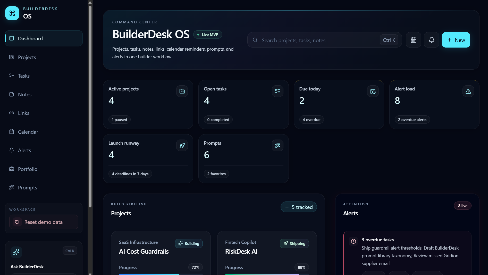
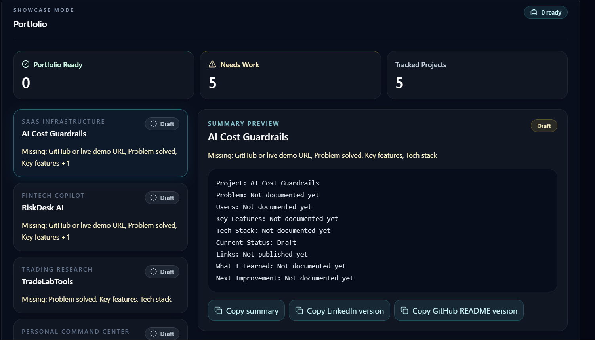
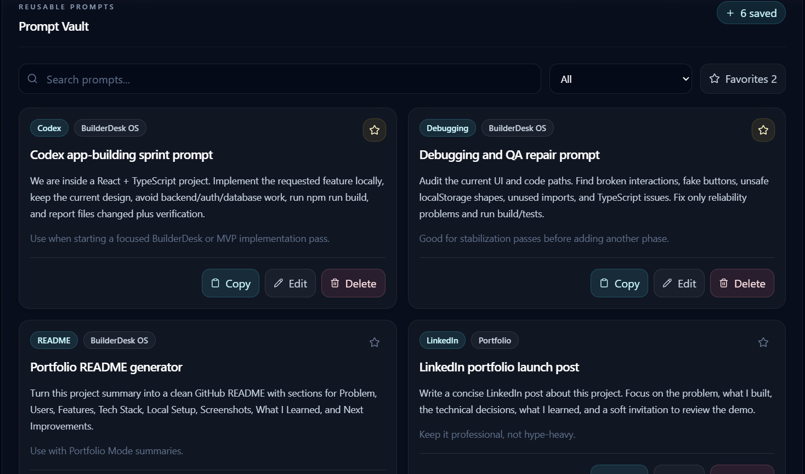

# BuilderDesk OS

"A local-first command center for builders managing projects, tasks, notes, links, reminders, prompts, and portfolio summaries."

BuilderDesk OS is a polished frontend MVP for people building several software, AI, product, or portfolio projects at once. It brings the scattered pieces of a builder workflow into one local dashboard: project status, next actions, tasks, saved links, notes, reminders, prompt templates, alerts, and portfolio-ready summaries.

## Overview

Builders often track work across too many places: GitHub repos, deployment links, sticky notes, calendar reminders, AI prompts, README drafts, portfolio notes, and launch tasks. BuilderDesk OS solves that problem by acting as a calm local command center where those pieces can be managed together without a backend or account system.

The app is intentionally local-first. Demo data loads on first use, user changes persist in browser `localStorage`, and the workspace can be reset back to the demo state at any time.

## Key Features

- Project dashboard with status, progress, next action, due date, and project links.
- Local-first project, task, note, and saved link management.
- Calendar and reminder system for deadlines, milestones, follow-ups, and reviews.
- Dynamic alerts and attention panel for overdue items, due-today work, paused projects, missing next actions, and upcoming deadlines.
- Portfolio Mode for readiness checks and generated project summaries.
- Prompt Vault for reusable AI, Codex, ChatGPT, debugging, README, LinkedIn, planning, trading, and deployment prompts.
- Header search and quick-create menu for fast navigation and capture.
- `localStorage` persistence with safe data normalization.
- Reset demo data action for portfolio demos and clean restarts.
- Utility tests with Vitest.

## Tech Stack

- React
- TypeScript
- Vite
- Tailwind CSS
- lucide-react
- Vitest
- Browser `localStorage`

## Screenshots

> Screenshot placeholders are included for portfolio publishing. Add actual images before sharing the final project page.







## Getting Started

Install dependencies:

```bash
npm install
```

Start the local development server:

```bash
npm run dev
```

Create a production build:

```bash
npm run build
```

Run tests:

```bash
npm run test -- --run
```

Preview the production build locally:

```bash
npm run preview
```

## Project Structure

```text
src/
  components/  Reusable UI panels, cards, forms, dashboard sections, and feature views.
  data/        Demo/mock data used on first load and when resetting the workspace.
  hooks/       Local React hooks, including localStorage persistence.
  utils/       Date helpers, alert generation, data normalization, portfolio logic, and prompt filtering.
```

## Deployment Notes

BuilderDesk OS is ready for a standard Vite deployment.

For Vercel:

- Framework preset: Vite
- Build command: `npm run build`
- Output directory: `dist`

No custom `vercel.json` is required for the current local-first MVP.

## Why I Built This

BuilderDesk OS was built to organize multiple AI, product, and software projects in one place. Instead of spreading project links, reminders, tasks, prompts, and portfolio notes across separate tools, the app gives builders a focused workspace for daily execution and portfolio preparation.

## Portfolio Note

This is a frontend, local-first MVP designed as a polished productivity tool and portfolio project. It demonstrates React state management, TypeScript modeling, local persistence, UI composition, utility testing, and a practical builder-focused product concept without relying on a backend, database, authentication, or routing.
